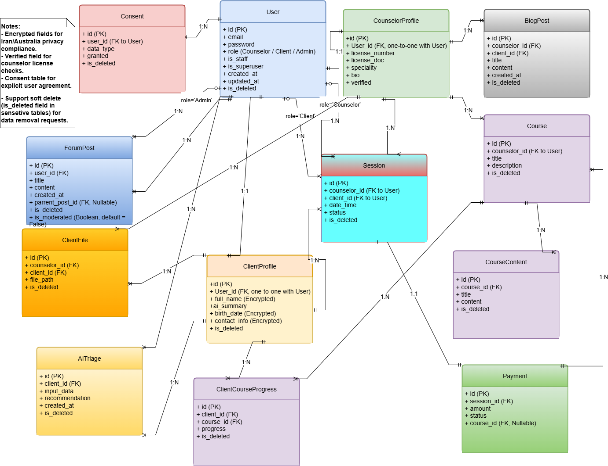

# Entity Relationship Diagram (ERD)

This document outlines the database structure of the project, consisting of 13 primary tables and their relationships. The ERD is based on the latest agreed-upon design.

## Primary Tables

### User
- **Fields**: `id (PK)`, `email`, `password`, `role (Counselor/Client/Admin)`, `is_staff`, `is_superuser`, `created_at`, `updated_at`, `is_deleted`.
- **Description**: The main table for users with various roles.

### CounselorProfile
- **Fields**: `id (PK)`, `user_id (FK)`, `license_number`, `license_doc`, `specialty`, `bio`, `verified`, `created_at`, `updated_at`, `is_deleted`.
- **Description**: Profile details for counselors, linked to the User table.

### ClientProfile
- **Fields**: `id (PK)`, `user_id (FK)`, `full_name (Encrypted)`, `phone_number`, `ai_summary (Encrypted)`, `created_at`, `updated_at`, `is_deleted`.
- **Description**: Profile details for clients, linked to the User table.

### Course
- **Fields**: `id (PK)`, `counselor_id (FK)`, `title`, `description`, `price`, `created_at`, `updated_at`, `is_deleted`.
- **Description**: Information about courses created by counselors.

### CourseContent
- **Fields**: `id (PK)`, `course_id (FK)`, `title`, `content`, `created_at`, `updated_at`, `is_deleted`.
- **Description**: Content associated with courses.

### ClientCourseProgress
- **Fields**: `id (PK)`, `client_id (FK)`, `course_id (FK)`, `progress`, `created_at`, `updated_at`, `is_deleted`.
- **Description**: Tracks client progress in courses.

### Session
- **Fields**: `id (PK)`, `client_id (FK)`, `counselor_id (FK)`, `date_time`, `status`, `ai_summary (Encrypted)`, `created_at`, `updated_at`, `is_deleted`.
- **Description**: Details of counseling sessions.

### Payment
- **Fields**: `id (PK)`, `session_id (FK)`, `course_id (FK, Nullable)`, `amount`, `status`, `created_at`, `updated_at`, `is_deleted`.
- **Description**: Payment records for sessions or courses.

### BlogPost
- **Fields**: `id (PK)`, `counselor_id (FK)`, `title`, `content`, `created_at`, `updated_at`, `is_deleted`.
- **Description**: Blog posts authored by counselors.

### ForumPost
- **Fields**: `id (PK)`, `user_id (FK)`, `parent_post_id (FK, Nullable)`, `title`, `content`, `created_at`, `updated_at`, `is_deleted`.
- **Description**: Forum posts with optional parent-child relationships.

### ClientFile
- **Fields**: `id (PK)`, `client_id (FK)`, `counselor_id (FK)`, `file_path`, `created_at`, `updated_at`, `is_deleted`.
- **Description**: Client-related files.

### Consent
- **Fields**: `id (PK)`, `user_id (FK)`, `data_type`, `granted`, `created_at`, `updated_at`, `is_deleted`.
- **Description**: User consent records.

### AITriage
- **Fields**: `id (PK)`, `user_id (FK)`, `input_data`, `recommendation`, `created_at`, `updated_at`, `is_deleted`.
- **Description**: Data for the AI triage system, restricted to Admin roles.

## Relationships
- **User → CounselorProfile**: 1:1.
- **User → ClientProfile**: 1:1.
- **ClientProfile → ClientCourseProgress**: 1:N.
- **User → AITriage**: 1:N (applies only to `role='Admin'`).
- **Course → CourseContent**: 1:N.
- **Course → Payment**: 1:N (Nullable).
- **Session → Payment**: 1:N.

## Diagram
For a visual representation of the ERD, refer to the image below (to be generated from Draw.io):

## Notes
- All tables include standard fields `created_at`, `updated_at`, and `is_deleted` for data management.
- Relationships are defined with appropriate cardinality (1:1, 1:N).